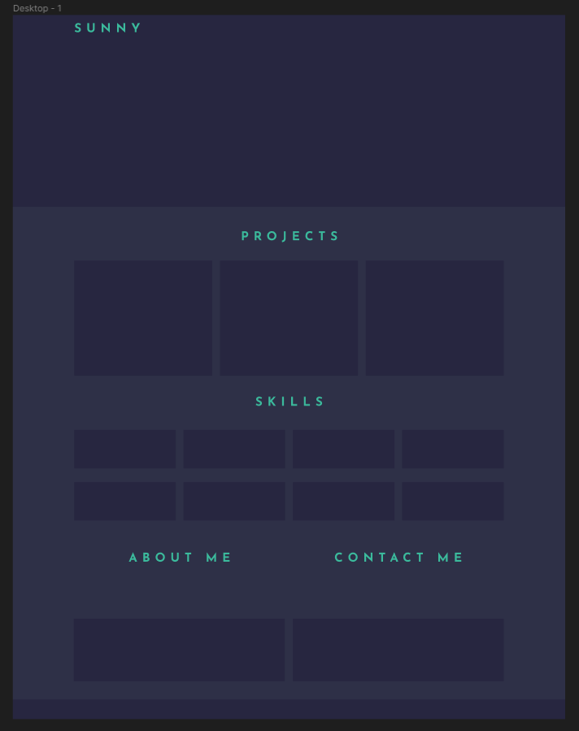

# Bootstrap-Portfolio
Web project portfolio utilising Bootstrap.

The following is a small Bootstrap Web Portfolio to showcase completed projects

## Project Description

The aim of this project is to recreate the original HTML and CSS [portfolio](https://github.com/sunnymudhar/UBHM-Portfolio) using the CSS Bootstrap framework. Using [Bootstrap](https://getbootstrap.com/), the layout of the site can be split equally into 12 columns to contain the websites assets. Using these columns, assets can be resized and distributed across the webpage and responsively displayed across a variety of screen sizes, ranging from desktops to small smart phone screens. Upon resizing the webpage to a smaller window, certain assets will be removed from their containing row and stacked ontop of other assets from the same category, displaying content in a mobile friendly layout.

Although awaiting the addition of future works, this portfolio will highlight my best works recently produced, complete with deployed applications and their links. Early iterations of this portfolio will contain placeholder projects, however these placeholders will be updated as more projects are completed and deployed.

The portfolio itself may see future updates, with earlier iterations viewable within this GitHub repos commit records. Future iterations may include, but are not limited to:

* Updated UI
* Inclusion of animations
* Replacement assets such as images

### Completed Tasks:

* Recreated original [portfolio](https://github.com/sunielmudhar/UBHM-Portfolio) using the Bootstrap CSS framework.
* Customised Bootstrap navigation bar.
* Links with appropriate box shadowing on hover.
* Hero/Jumotron with Avatar, name and brief intro.
* Work section, displaying work in a grid structure and with each project using the Bootstrap card template.
* Skills section.
* Footer.
* Responsive web design with no media queries.

## Wireframe:

Below is a wireframe layout of the portfoilio created using Figma. This wireframe was used as a template to construct the general design and layout of the portfolio, detailing colours, fonts, layout and theme.

## Installation

This single static website can be deployed either locally or to a webserver. With the included "index.html" file containing the main code for the website, and the accompanying "style.css" stylesheet. Alternatively, the website can be found on the GitHub Pages link below.

Designed primarily for a desktop experience, the site can be accessed on small screen sizes, with a minimum screensize of 600px horizontally. Please keep this in mind when accessing the site on your device.

### GitHub Pages:

[GitHub Pages](https://sunnymudhar.github.io/Bootstrap-Portfolio/)

## Credits
The following resources were used in order to help complete this refactoring task:

* [Font Awesome for icons](https://fontawesome.com/)
* [Hover transition effects](https://www.w3schools.com/css/css3_transitions.asp)
